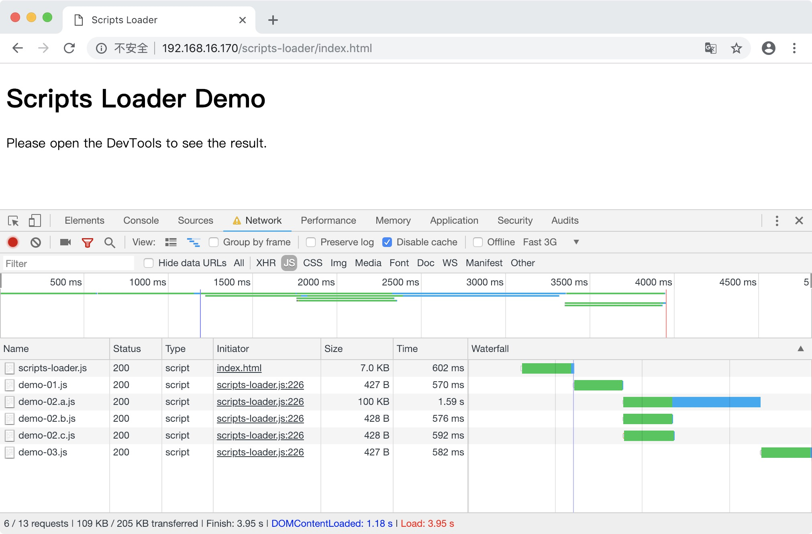

# Scripts Loader

一个 JavaScript 脚本异步加载器，用于控制脚本动态加载流程。功能如下：

* 按指定顺序加载脚本：各脚本以预设的顺序进行串行加载；
* 按分组顺序加载脚本：各分组按照指定顺序进行串行加载，分组内的脚步并行加载；
* 支持以上两种加载方式的任意组合。

> 注意：此工具只有在需要**动态加载脚本**的时候才有使用的必要。如果是静态加载，直接使用 `<script>` 标签是更明智的选择。



## 说明

假设现有一个项目结构如下：

````text
src
 ├── demo-01.js
 ├── demo-02.a.js
 ├── demo-02.b.js
 ├── demo-02.c.js
 └── demo-03.js
````

其依赖关系如下：

* `demo-02.*.js` 依赖了 `demo-01.js`
* `demo-02.a.js`、`demo-02.b.js` 和 `demo-02.c.js` 之间没有依赖关系
* `demo-03.js` 依赖了 `demo-02.*.js`

现在我们希望动态加载上述脚本，并且要求加载流程如下：

1. 先加载 `demo-01.js`
2. 第 1 步完成后，并行加载 `demo-02.a.js`、`demo-02.b.js` 和 `demo-02.c.js`
3. 第 2 步完成后，再加载 `demo-03.js`

> 由于 `demo-02.*.js` 之间没有依赖关系，所以我们希望并行加载以减少加载时间。

根据以上要求，我们可以构造出一个像下面这样简单的配置信息。其中 key 表示要加载的脚本的 URL，对应的数值表示脚本的优先级，数值越小表示优先级越高。数值相同的 URL 会并行加载。配置如下：

```json
{
    "src/demo-01.js": 1,
    "src/demo-02.a.js": 2,
    "src/demo-02.b.js": 2,
    "src/demo-02.c.js": 2,
    "src/demo-03.js": 3
}
```

> 脚本的加载顺序与配置的书写顺序无关，只与对应的优先级数值有关，数值越小优先级越高。

根据以上配置，脚本加载的瀑布流应该如下：

```text
src/demo-01.js |
               | src/demo-02.a.js |
               | src/demo-02.b.js |
               | src/demo-02.c.js |
                                  | src/demo-03.js
```

以上便是需求。

## API

根据以上需求，我们定义了一个 ScriptLoader 类，她有一个静态方法可以用于创建 ScriptLoader 实例：

```js
/**
 * 创建一个 ScriptLoader
 *
 * @param {Object} urlPriorityMap  脚本 URL 和优先级映射表
 * @param {Object} [settings={}] 可选的配置信息
 * @returns {ScriptsLoader}
 */
ScriptLoader.load(urlPriorityMap, settings);
```

如果你想监听每个脚本加载过程的生命周期事件，你可以注册一个 lifecycle 函数，在该函数中可以监听到所有脚本的生命周期事件。函数签名如下：

```js
/**
 * 注册脚本加载生命周期回调函数
 *
 * 注意：最多只能注册一个生命周期函数，后面设置的会覆盖前面的。
 *
 * @param {(event: LifecycleEvent) => void} onlifecycle 生命周期回调函数
 * @returns {ScriptsLoader} 返回 this
 */
ScriptsLoader.prototype.lifecycle(onlifecycle);
```

每次 lifecycle 回调函数被调用时，会收到一个 LifecycleEvent 对象，该对象中包含的事件相关信息，其类型定义如下：

```js
/**
 * 加载脚本生命周期事件
 * @typedef  {Object}  LifecycleEvent
 * @property {string}  url 脚本 url
 * @property {Object}  settings 配置信息
 * @property {boolean} error 是否出错
 * @property {boolean} finished 是否完成
 * @property {number}  code 状态码
 * @property {string}  type 状态文本
 * @property {string}  message 提示信息
 *
 * code - type - 说明：
 *
 * 1 - EVENT_LOADING  - 加载中
 * 2 - EVENT_SUCCESS  - 加载成功
 * 3 - ERROR_TIMEOUT  - 已超时
 * 4 - ERROR_NETWORK  - 网络错误
 * 5 - ERROR_SETTINGS - 配置错误
 */
```

ScriptLoader 实例创建完成后，并不会立即触发加载，需要我们手动调用 start 函数，该函数签名如下：

```js
/**
 * 开始加载脚本
 *
 * 注意：这个函数只能被调用一次，多余的调用将会被忽略。
 *
 * @param {() => void} [onfinish] 下载完成回调
 * @returns {ScriptsLoader} 返回 this
 */
ScriptsLoader.prototype.start(onfinish);
```

下面是一个完整的示例：

```js
ScriptLoader.load({
    "src/demo-01.js": 1,
    "src/demo-02.a.js": 2,
    "src/demo-02.b.js": 2,
    "src/demo-02.c.js": 2,
    "src/demo-03.js": 3
}, {
    // 超时时间，单位毫秒。如果设置为 0 或者不设置任何值，表示一直等待。
    timeout: 60000,
    // 设置 <script> 标签属性，此方法会调用 setAttribute 方法来进行设置。
    attrs: {
        // 以下两项为默认配置
        "charset": "utf-8",
        "type": "text/javascript"
        // more ...
    }
}).lifecycle(function (event) {
    console.log(event.type + ' => ' + event.url);
}).start(function () {
    console.log('All scripts loaded.');
});
```

如果你没有那么多设置，一个最简单的配置如下：

```js
ScriptsLoader.load({
    "src/demo-01.js": 1,
    "src/demo-02.a.js": 2,
    "src/demo-02.b.js": 2,
    "src/demo-02.c.js": 2,
    "src/demo-03.js": 3
}).start();
```

你可以[点击此处查看在线演示页面](https://john-yuan.github.io/scripts-loader/index.html)。
