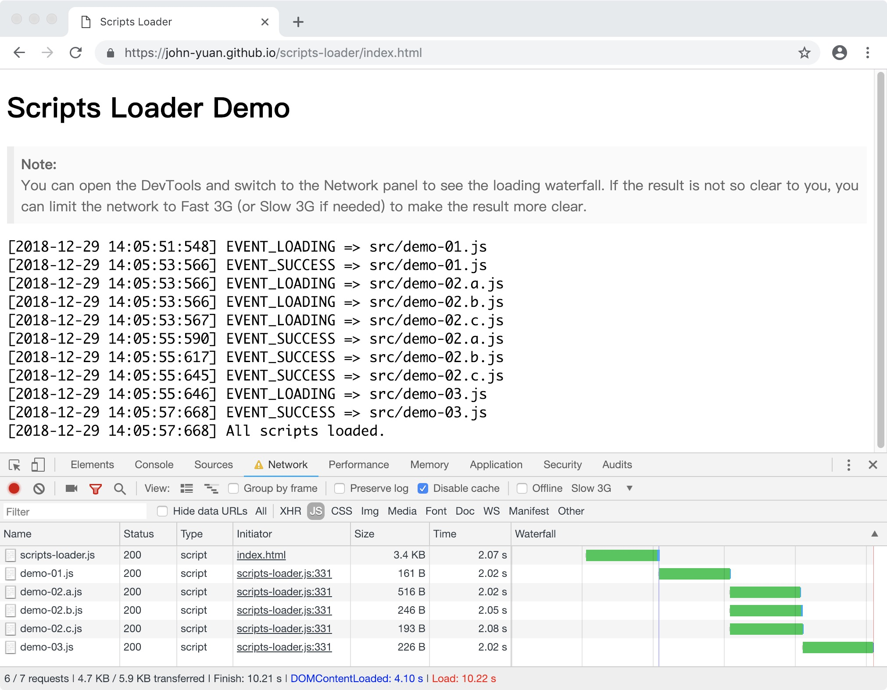

# Scripts Loader

一个 JavaScript 脚本异步加载器，用于控制脚本动态加载流程。功能如下：

* 按指定顺序加载脚本：各脚本以预设的顺序进行串行加载；
* 按分组顺序加载脚本：各分组按照指定顺序进行串行加载，分组内的脚步并行加载；
* 支持以上两种加载方式的任意组合。

> 注意：此工具只有在需要**动态加载脚本**的时候才有使用的必要。如果是静态加载，直接使用 `<script>` 标签是更明智的选择。

## 说明

假设现有一个项目结构如下：

````text
src
 ├── demo-01.js
 ├── demo-02.a.js
 ├── demo-02.b.js
 ├── demo-02.c.js
 └── demo-03.js
````

其依赖关系如下：

* `demo-02.*.js` 依赖了 `demo-01.js`
* `demo-02.a.js`、`demo-02.b.js` 和 `demo-02.c.js` 之间没有依赖关系
* `demo-03.js` 依赖了 `demo-02.*.js`

现在我们希望动态加载上述脚本，并且要求加载流程如下：

1. 先加载 `demo-01.js`
2. 第 1 步完成后，并行加载 `demo-02.a.js`、`demo-02.b.js` 和 `demo-02.c.js`
3. 第 2 步完成后，再加载 `demo-03.js`

> 由于 `demo-02.*.js` 之间没有依赖关系，所以我们希望并行加载以减少加载时间。

根据以上要求，我们可以构造出一个像下面这样简单的配置信息。其中 key 表示要加载的脚本的 URL，对应的数值表示脚本的优先级，数值越小表示优先级越高。数值相同的 URL 会并行加载。配置如下：

```json
{
    "src/demo-01.js": 1,
    "src/demo-02.a.js": 2,
    "src/demo-02.b.js": 2,
    "src/demo-02.c.js": 2,
    "src/demo-03.js": 3
}
```

> 脚本的加载顺序与配置的书写顺序无关，只与对应的优先级数值有关，数值越小优先级越高。

根据以上配置，脚本加载的瀑布流应该如下：

```text
src/demo-01.js |
               | src/demo-02.a.js |
               | src/demo-02.b.js |
               | src/demo-02.c.js |
                                  | src/demo-03.js
```

以上便是需求。

## API 及 示例

我们定义了一个 ScriptLoader 类，她有一个静态方法可以用于创建 ScriptLoader 实例：

```js
/**
 * 使用指定的 urlPriorityMap 创建一个 ScriptLoader
 *
 * @param {Object} urlPriorityMap  脚本 URL 和优先级映射表
 * @returns {ScriptsLoader}
 */
ScriptLoader.load(urlPriorityMap);
```

根据返回的 ScriptLoader 实例，我们可以调用该实例的 start 方法以开始加载脚本。该方法的签名如下：

```js
/**
 * 开始加载脚本，这个函数只能被调用一次，多余的调用将会被忽略
 *
 * @param {() => void} [onfinish] 下载完成回调
 */
ScriptsLoader.prototype.start(onfinish);
```

以下为一个示例，你可以 clone 本项目，访问 index.html，然后打开控制台查看效果。

```html
<script src="./scripts-loader.js"></script>
<script type="text/javascript">
    ScriptsLoader.load({
        "src/demo-01.js": 1,
        "src/demo-02.a.js": 2,
        "src/demo-02.b.js": 2,
        "src/demo-02.c.js": 2,
        "src/demo-03.js": 3
    }).start(function () {
        console.log('scripts loaded.');
    });
</script>
```

下图为运行效果截图：


